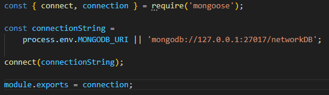
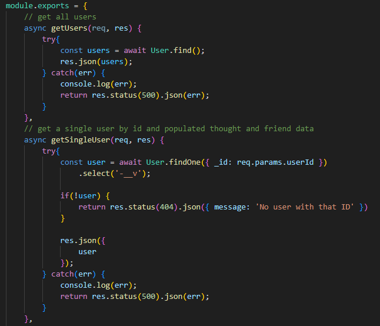
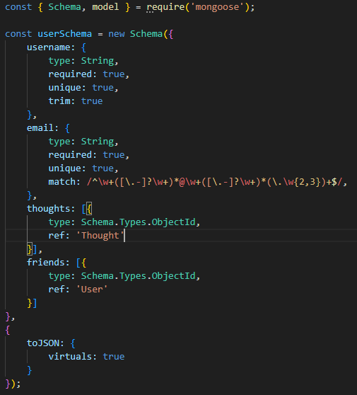
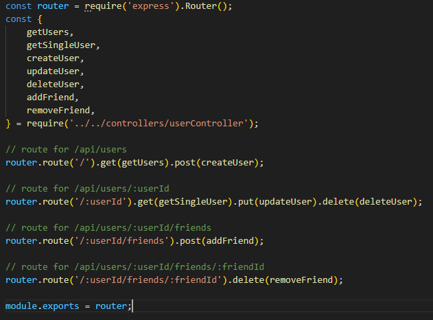
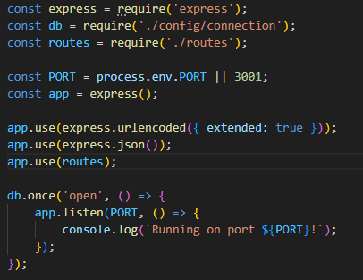

# social-network-api

## Description

This project allows users to create an account, add friends, post thoughts, and post reactions to other friend's thoughts. It utilizes the use of a NoSQL database in order to store large amounts of information.

Walkthrough Video: (https://drive.google.com/file/d/1rNdURqcgZdES6uQQLSUDLzxH_E2rg2vf/view)

## Table of Contents

- [Installation](#installation)
- [Usage](#usage)
- [Credits](#credits)

## Installation

1. Have node.js installed (https://nodejs.org/en)
2. `npm install` in the terminal
3. `node server.js` in the terminal to run the server

## Usage

We need to import the connection to mongoose so that it'll be accessible throughout all the files. Make sure to do a `npm install mongoose` first, though.

**This project has a lot of code, so we'll be taking a deeper look at part of the user routes and model.**

These controller routes create an asynchronous function to get all users and users by id through the req.params.userId, which is received through the :userId in the api route below.

This user model contains username, email, and references to thoughts and self-references to friends.

In the routes folder, all the asynchronous functions are imported to create api routes, where we can test them in Insomnia.

The server.js contains all our middlewares and imports for the routing to function.

## Credits

- Tutor Joem Casusi
- UCB Bootcamp Activities